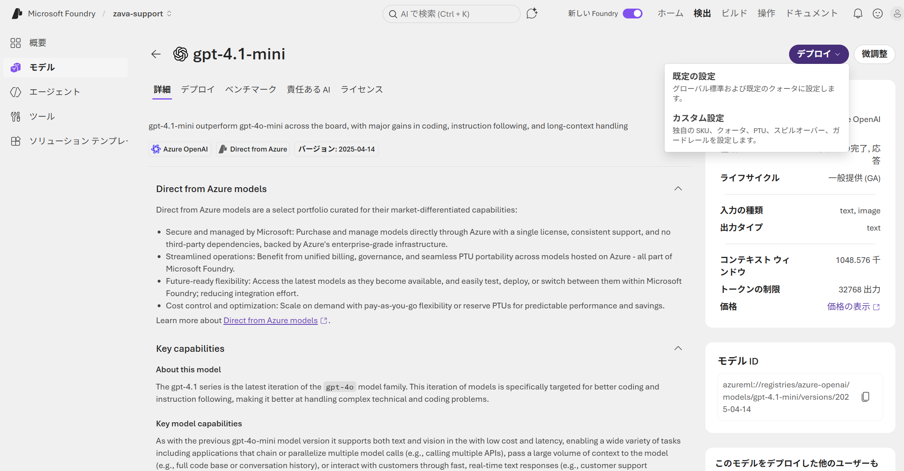
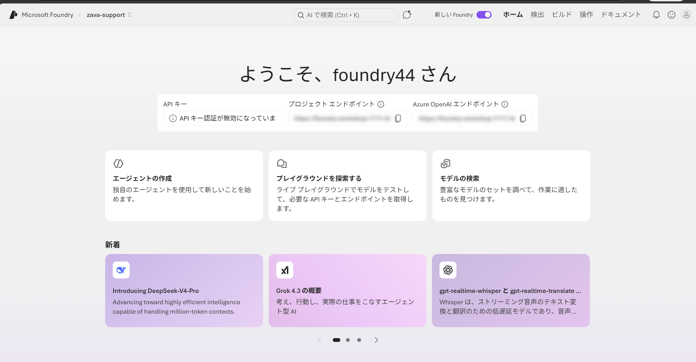

# Part 1: Foundry Agent を SDK/CLI で作る → MAF から呼び出す (70min)

> ⚠️ **シェル環境について**: 本ワークショップのコマンド例は **PowerShell** 環境を前提としています。  
> macOS / Linux (bash, zsh など) のユーザーは、変数定義 (`$VAR=...` → `VAR=...`) や行継続 (`` ` `` → `\`) などを各自の環境に合わせて書き換えて実行してください。

## 🎯 このパートのゴール

- Azure CLI (`az`) で Foundry リソース（AI Services / プロジェクト / モデルデプロイ）を作成する
- Foundry SDK (`azure-ai-projects`) を使って **Prompt Agent** を作成する
- Microsoft Agent Framework (MAF) を使って **Agent X** を構築する
- Agent X にカスタムツール（Zava カスタマーサポート用）を実装する
- MAF から Foundry Agent を呼び出す方法を理解する

## 📋 前提条件

| 項目 | 要件 | 確認方法 |
|------|------|---------|
| Python | 3.11 以上 | `python --version` |
| Azure CLI | 2.60 以上 | `az version` |
| VS Code | Python 拡張機能インストール済み | 拡張機能パネルで確認 |
| Azure サブスクリプション | 有効なサブスクリプション | `az account show` |
| Azure CLI ログイン | 正しいテナントにログイン済み | 下記参照 |

### Azure CLI ログインの確認

```powershell
# 現在のログイン状態を確認
az account show --query "{name:name, tenantId:tenantId}" -o table

# ログインしていない / テナントが違う場合:
az login --tenant <YOUR-TENANT-ID>
```

> ⚠️ **テナント ID の確認方法**: Azure Portal → Microsoft Entra ID → 概要 → テナント ID  
> または `az account list --query "[].{Name:name, TenantId:tenantId}" -o table` で一覧表示

## 🎬 ワークショップのシナリオ

このワークショップでは、架空の EC 企業「**Zava (ザバ)**」のカスタマーサポートを AI エージェントで自動化するシナリオで進めます。

| 項目 | 内容 |
|------|------|
| 企業 | Zava — イヤホン・スマートウォッチ等を販売する架空の EC サイト |
| 課題 | カスタマーサポートの問い合わせ量が増加し、人手では対応しきれない |
| ソリューション | AI エージェントが注文履歴検索・FAQ 回答・エスカレーション判定を自動化 |
| 構成 | Agent X (専門エージェント) を中心としたエージェント構成 |

> 💡 Zava はこのワークショップ用の架空の企業です。実在のサービスとは関係ありません。

---

## 演習 0: Azure CLI で Foundry リソースを作成する (15min)

この演習では Azure CLI を使って、ハンズオンに必要な Foundry リソースを作成します。

### 0.1 変数の設定

```powershell
# ---- お好みで変更してください ----
$RESOURCE_GROUP = "rg-foundry-workshop"
$LOCATION = "eastus2"
$AI_SERVICES_NAME = "ai-foundry-workshop-$(Get-Random -Maximum 9999)"  # 名前はグローバル一意
$PROJECT_NAME = "zava-support"
$MODEL_DEPLOYMENT_NAME = "gpt-4.1-mini"
```

> ⚠️ `$AI_SERVICES_NAME` はグローバルで一意な名前が必要です。`Get-Random` で自動生成していますが、万が一名前が被った場合は再実行してください。

### 0.2 リソースグループの作成

```powershell
az group create --name $RESOURCE_GROUP --location $LOCATION
```

### 0.3 Foundry リソースとプロジェクトの作成 (Azure Portal から作成)
`az ai` 拡張機能が現状利用不可のため、Foundry リソース (AI Services) と プロジェクトは **Azure Portal** からまとめて作成します。

#### 手順

1. ブラウザで [Azure Portal](https://portal.azure.com/) を開く
2. 右上の **ディレクトリ** が `az account show` で確認したテナントと一致していることを確認
3. 画面上部の **検索バー** に `Foundry` と入力し、サービス一覧の **「Microsoft Foundry」** をクリック
4. **「+ 作成」** (Create) をクリック
5. **「インスタンスの詳細」** で次のように入力:
   - **サブスクリプション**: 利用するサブスクリプション
   - **リソースグループ**: 演習 0.2 で作成した `rg-foundry-workshop`
   - **リージョン**: `East US 2` (演習 0.1 の `$LOCATION` と合わせる)
   - **名前 (リソース名)**: 演習 0.1 の `$AI_SERVICES_NAME` の値 (例: `ai-foundry-workshop-xxxx`) — グローバル一意
6. **「プロジェクト」** セクションで **「プロジェクトを作成する」** にチェックを入れ、プロジェクト名に **`zava-support`** (= 演習 0.1 の `$PROJECT_NAME`) を入力 — Foundry リソースとプロジェクトを同時に作成します
7. **「確認と作成」** → **「作成」** をクリックし、プロビジョニング完了を待つ (2〜3 分)


**✅ 成功確認:**
- デプロイ完了後 **「リソースに移動」** をクリックし、Microsoft Foundry リソースの概要ページが開く
- 概要ページ上部の **「Microsoft Foundry portal で開く」** リンクから `zava-support` プロジェクトを開ける
- プロジェクトの Overview に **Microsoft Foundry project endpoint** (`https://<account>.services.ai.azure.com/api/projects/<project>`) が表示される

> ⚠️ この **Project endpoint** は演習 0.5 / 1.3 で使うので、控えておいてください。

### 0.4 モデルのデプロイ (Microsoft Foundry ポータルから)

演習 0.3 で作成した `zava-support` プロジェクトに、本ワークショップで使用する `gpt-4.1-mini` モデルをデプロイします。

#### 手順

1. [Microsoft Foundry ポータル](https://ai.azure.com/) を開き、`zava-support` プロジェクトを選択
2. 上部メニューの **「ビルド」** をクリックし、左ナビゲーションから**「モデル」**)を開く
3. **「 基本モデルをデプロイする」** をクリック
4. モデル一覧から **`gpt-4.1-mini`** を選択し、**「確認」** をクリック
5. **「デプロイ」** をクリックし、表示されたダイアログでは既定の設定 」 をクリックし、デプロイを実行



**✅ 成功確認:**
- デプロイ一覧に `gpt-4.1-mini` が **「成功」** ステータスで表示される
- デプロイ名が演習 0.1 の `$MODEL_DEPLOYMENT_NAME` の値と一致している

### 0.5 エンドポイントとテナント ID の確認

#### プロジェクトエンドポイント (Foundry ポータルから取得)

> 💡 演習 0.3 のプロビジョニング完了時に **Project endpoint** を控えてあれば、この手順はスキップして構いません。  
> 控え忘れた場合のみ、以下の手順で再取得してください。

1. New UI の [Microsoft Foundry ポータル](https://ai.azure.com/) で `zava-support` プロジェクトを開く
2. プロジェクトの **「ホーム」** 画面を表示する
3. **「プロジェクトエンドポイント」** 欄の右側にあるコピーボタンをクリックし、値をコピーする
   - 形式: `https://<account>.services.ai.azure.com/api/projects/<project>`



コピーした値はメモ帳などに控えておき、演習 1.3 で `.env` の `FOUNDRY_PROJECT_ENDPOINT` に貼り付けます。

#### テナント ID の取得

以下のコマンドで現在のテナント ID を確認します。出力された値も控えておき、演習 1.3 で `.env` の `AZURE_TENANT_ID` に貼り付けます。

```powershell
az account show --query tenantId -o tsv
```

> 💡 アプリケーションは `.env` から値を読み込むため、ここでは PowerShell の環境変数に設定する必要はありません。値が分かれば次の演習に進めます。

---

## 演習 1: Foundry SDK でエージェントを作成する (20min)

> ❗ **前提**: 演習 0 が完了していること。プロジェクトエンドポイントとテナント ID が手元にあることを確認してください。

### 1.1 環境セットアップ

リポジトリのルートディレクトリ（`Foundry-in-a-day-3/`）から実行してください:

```powershell
cd labs/lab1-sdk-and-agent-framework
python -m venv .venv

# Windows
.venv\Scripts\activate

# macOS/Linux
# source .venv/bin/activate

pip install -r requirements.txt
```

> ⚠️ `pip install` が完了するまで 1〜2 分かかります。エラーが出た場合は Python のバージョンを確認してください。

### 1.3 環境変数の設定

`.env.template` をコピーして `.env` を作成し、値を設定します。

```powershell
Copy-Item .env.template .env
```

`.env` を VS Code で開いて編集します:

```env
# 演習 0.5 で取得したエンドポイント
FOUNDRY_PROJECT_ENDPOINT="https://<YOUR-RESOURCE-NAME>.services.ai.azure.com/api/projects/<YOUR-PROJECT-NAME>"

# そのまま (演習 0.4 でデプロイしたモデル名)
AZURE_AI_MODEL_DEPLOYMENT_NAME="gpt-4.1-mini"

# そのまま
MICROSOFT_FOUNDRY_AGENT_NAME="zava-support-agent-x"

# 演習 0.5 で取得したテナント ID
AZURE_TENANT_ID="<YOUR-TENANT-ID>"
```

> ⚠️ **よくあるミス**: エンドポイントの末尾に `/` を付けないでください。  
> 💡 **テナント ID を設定しないとどうなる?**: 認証トークンのテナントが不一致となり、  
> `Token tenant ... does not match resource tenant` エラーが発生します。

### 1.4 Prompt Agent の作成 (SDK)

`src/agent_x/create_agent.py` を実行して Foundry 上に Prompt Agent を作成します。

```powershell
python src/agent_x/create_agent.py
```

**✅ 期待される出力:**
```
✅ Agent created successfully!
   Name:    zava-support-agent-x
   ID:      zava-support-agent-x:1
   Version: 1
   Model:   gpt-4.1-mini

💡 次のステップ: chat_with_agent.py でエージェントと対話してみましょう
```

**ポイント解説:**
- `AIProjectClient` — Foundry プロジェクトに接続するクライアント
- `AzureCliCredential(tenant_id=...)` — `az login` のトークンを使って認証
- `PromptAgentDefinition` — エージェントの定義（モデル・指示文）を設定
- `project.agents.create_version()` — バージョン管理されたエージェントを作成

### 1.5 エージェントとの対話テスト (SDK)

作成したエージェントに対して SDK 経由でメッセージを送信します。

```powershell
python src/agent_x/chat_with_agent.py
```

**✅ 期待される出力例:**
```
🔗 Conversation started (ID: conv_xxxxx...)
🤖 Agent: zava-support-agent-x
--------------------------------------------------

📤 User: 顧客ID C001 の最近の注文について教えてください
📥 Agent: かしこまりました。顧客ID C001様の最近のご注文内容を確認いたします...

📤 User: その注文のステータスを確認してもらえますか？
📥 Agent: 承知いたしました。...

📤 User: 返品ポリシーについて教えてください
📥 Agent: 返品ポリシーについてご案内いたします。...

--------------------------------------------------
✅ マルチターン会話のテスト完了!
```

**ポイント解説:**
- `project.get_openai_client()` — OpenAI 互換クライアントを取得
- `openai.conversations.create()` — マルチターン会話を開始（会話 ID で状態管理）
- `openai.responses.create(conversation=..., input=...)` — 会話 ID を指定してメッセージ送信
- `extra_body={"agent_reference": ...}` — 呼び出すエージェントを名前で指定

> 💡 **なぜ OpenAI 互換?**: Foundry は OpenAI API と互換のインターフェースを提供しています。  
> 既存の OpenAI SDK の知識がそのまま使えるため、学習コストが低いのがメリットです。

---

## 演習 2: MAF で Agent X を構築する (20min)

### 2.1 Agent X の概要

Agent X は **Zava カスタマーサポートの専門エージェント** です。以下のツールを持ちます:

| ツール | 説明 | 利用シーン |
|--------|------|-----------|
| `search_order_history` | 顧客の注文履歴を検索する | 「注文の状況を教えて」 |
| `search_faq` | FAQ データベースから回答を検索する | 「返品ポリシーは？」 |
| `check_escalation_needed` | エスカレーションが必要か判定する | 「不良品だ！返金しろ！」 |

> 💡 **MAF とは?**: Microsoft Agent Framework はエージェントの構築・ホスティングを行うフレームワークです。  
> ツール定義 + LLM クライアント + 指示文を一つの Agent オブジェクトにまとめ、HTTP サーバーとして公開できます。

### 2.2 コード解説: main.py

`src/agent_x/main.py` を VS Code で開いて構造を確認します。

```python
from agent_framework import Agent, tool          # MAF コア
from agent_framework.foundry import FoundryChatClient  # Foundry 接続
from agent_framework_foundry_hosting import ResponsesHostServer  # HTTP サーバー
```

**重要な構成要素:**

| コンポーネント | 役割 |
|----------------|------|
| `FoundryChatClient` | Foundry プロジェクトのモデルに接続するクライアント |
| `@tool` デコレータ | Python 関数を LLM が呼び出せるツールとして登録 |
| `Agent` | ツール + 指示文 + クライアントを束ねるエージェント定義 |
| `ResponsesHostServer` | Responses プロトコルで HTTP サーバーを起動 (port 8088) |

### 2.3 ツールの実装

各ツールは `@tool` デコレータで定義します:

```python
@tool(approval_mode="never_require")
def search_order_history(
    customer_id: Annotated[str, Field(description="顧客ID")],
) -> str:
    """顧客の注文履歴を検索します。"""
    # 実装...
```

**ツール定義のポイント:**
- `@tool(approval_mode="never_require")` — 人間の承認なしで自動実行
- `Annotated[str, Field(description="...")]` — LLM に引数の説明を伝える
- docstring — LLM がツール選択時に参照する説明文

> 💡 **ハンズオン**: `src/agent_x/main.py` のツール部分を確認し、追加のツールを実装してみましょう。

### 2.4 ローカルでの実行とテスト

**ターミナル 1** でサーバーを起動:

```powershell
python src/agent_x/main.py
```

**✅ 期待される出力:**
```
🚀 Agent X starting on http://localhost:8088
   POST /responses でリクエストを送信してください
   Microsoft Learn MCP: 有効
YYYY-MM-DD ... INFO __main__: Microsoft Learn MCP tool registered
YYYY-MM-DD ... INFO hypercorn.error: Running on http://0.0.0.0:8088 (CTRL + C to quit)
```

> 💡 `Running on http://0.0.0.0:8088` が表示されたらサーバー起動完了です。  
> この状態でターミナルはブロックされるので、**別のターミナルを開いて** テストしてください。

**ターミナル 2** (新しいターミナルを開く) でリクエスト送信:

> 💡 以下のコマンドは長いですが、そのままコピー＆ペーストしてください。

```powershell
# 注文履歴の検索テスト
$body = '{"input": "顧客ID: C001 の注文履歴を教えて", "model": "gpt-4.1-mini"}'
$bytes = [System.Text.Encoding]::UTF8.GetBytes($body)
(Invoke-WebRequest -Uri http://localhost:8088/responses -Method POST -ContentType "application/json" -Body $bytes -TimeoutSec 60).Content | ConvertFrom-Json | ConvertTo-Json -Depth 5
```

> 💡 日本語を含む JSON を送る際は `[System.Text.Encoding]::UTF8.GetBytes()` で変換が必要です。  
> これがないと文字化けしてエージェントが正しく応答できません。

**✅ 期待される出力 (抜粋):**
```json
{
  "status": "completed",
  "output": [
    { "type": "function_call", "name": "search_order_history", ... },
    { "type": "function_call_output", ... },
    { "type": "message", "content": [{ "text": "顧客ID C001 の注文履歴は..." }] }
  ]
}
```

> 💡 `status` が `"completed"` であれば成功です。`"failed"` の場合はトラブルシューティングを参照してください。


## 演習 3: MAF から Foundry Agent を呼び出す (10min)

### 3.1 MAF から Foundry エージェントを呼ぶ ── `FoundryAgent`

MAF (`agent_framework_foundry`) には、Foundry に登録済みの Prompt / Hosted エージェントを **名前で参照して直接呼び出すクラス** が用意されています:

```python
from agent_framework_foundry import FoundryAgent
from azure.identity.aio import AzureCliCredential

async with AzureCliCredential(tenant_id=TENANT_ID) as credential:
    agent = FoundryAgent(
        project_endpoint=PROJECT_ENDPOINT,
        agent_name="zava-support-agent-x",   # 演習 1.4 で作成した Prompt Agent
        credential=credential,
    )

    session = agent.create_session()          # マルチターン用セッション
    result = await agent.run("顧客ID C001 の最近の注文を教えてください", session=session)
    print(result.text)
```

**ポイント:**
- `FoundryAgent` は内部で **`agent_reference`** (Foundry に登録済みエージェントを名前で呼び出す仕組み) を自動付与する
- 呼び出し元は「どのモデルを使っているか」「どんなツールを持っているか」を知らなくても、**エージェント名だけ** で利用できる
- ローカルツールを追加したい場合は `tools=[...]` を渡せば、Foundry の Prompt Agent + ローカルツールという構成も可能
- HostedAgent は `agent_version` 省略可、PromptAgent は通常 `agent_version` を指定する (省略時は最新)

### 3.2 デモ: 実際に呼び出してみる

`src/agent_x/chat_with_agent_maf.py` を実行:

```powershell
python src/agent_x/chat_with_agent_maf.py
```

**✅ 期待される出力例:**
```
============================================================
MAF FoundryAgent → Foundry Prompt Agent (zava-support-agent-x)
============================================================

--- ターン 1 ---
📤 User : 顧客ID C001 の最近の注文を教えてください
📥 Agent: ご連絡ありがとうございます。顧客ID C001様の直近のご注文は...

--- ターン 2 ---
📤 User : その注文がまだ届いていないようなのですが、ステータスを確認できますか？
📥 Agent: 配送業者のシステム上では、注文は…配達完了と記録されております...

--- ターン 3 ---
📤 User : 返品ポリシーについても教えてください
📥 Agent: 当社の返品ポリシーは以下の通りです...

============================================================
✅ 全ターン完了
```

> 💡 セッション (`agent.create_session()`) を共有しているため、ターン 2 で「その注文」と言及するだけで前回の文脈が引き継がれます。

> ⚠️ **注意**: 演習 1.4 で作成した Prompt Agent はツールを持たないため、「注文履歴」と聞いても  
> 実データを検索せずモデルが生成した内容を返します。実データを扱いたい場合は、  
> 演習 2 でローカルホストしたツール付き Agent X を Foundry にデプロイし (Lab 2 で扱います)、  
> `MICROSOFT_FOUNDRY_AGENT_NAME` をそちらに切り替えてください。

---

## 📝 まとめ

| やったこと | 使った技術 |
|------------|-----------|
| Foundry リソース作成 | Azure CLI (`az`) |
| Prompt Agent の作成 | `azure-ai-projects` SDK |
| Agent X の構築 | Microsoft Agent Framework (MAF) |
| ツール実装 | `@tool` デコレータ |
| ローカルテスト | `ResponsesHostServer` (port 8088) |
| Agent 間連携 | `agent_reference` による呼び出し |

## 🔗 参考リンク

- [Foundry Samples (GitHub)](https://github.com/microsoft-foundry/foundry-samples)
- [Microsoft Agent Framework](https://github.com/microsoft/agent-framework)
- [Foundry Hosted Agents Docs](https://learn.microsoft.com/azure/ai-foundry/agents/concepts/hosted-agents)
- [Agent Framework Quick Start](https://learn.microsoft.com/agent-framework/tutorials/quick-start)

---

## 🚨 トラブルシューティング

### エラー: `Token tenant ... does not match resource tenant`

**原因**: `.env` の `AZURE_TENANT_ID` が未設定、または `az login` のテナントとリソースのテナントが異なる。

**解決方法**:
```powershell
# 正しいテナント ID を確認
az account show --query tenantId -o tsv

# .env に設定
# AZURE_TENANT_ID="<上記の値>"

# 必要なら正しいテナントで再ログイン
az login --tenant <YOUR-TENANT-ID> --scope "https://ai.azure.com/.default"
```

### エラー: `Invoke-WebRequest` でタイムアウト

**原因**: サーバーが起動していない、またはポート 8088 が使用中。

**解決方法**:
```powershell
# サーバーが起動しているか確認
Get-NetTCPConnection -LocalPort 8088 -ErrorAction SilentlyContinue

# ポートが使用中なら停止
Get-NetTCPConnection -LocalPort 8088 | ForEach-Object { Stop-Process -Id $_.OwningProcess -Force }

# サーバーを再起動
python src/agent_x/main.py
```

### エラー: `az ai project create` で `'ai' is misspelled or not recognized by the system.`

**原因**: `az ai` 拡張機能が現時点 (2026/05) では公開停止 / 動的インストール対象外となっており、`az config set extension.dynamic_install_allow_preview=true` を実行しても解消しません。

**解決方法**: CLI ではなく [Microsoft Foundry ポータル](https://ai.azure.com/) から Foundry リソースとプロジェクトを作成してください。手順は [演習 0.3](#03-foundry-リソースとプロジェクトの作成-microsoft-foundry-ポータルから作成) を参照。

### エラー: `ModuleNotFoundError: No module named 'agent_framework'`

**原因**: 仮想環境が有効化されていない。

**解決方法**:
```powershell
# 仮想環境を有効化
.venv\Scripts\activate

# パッケージがインストールされているか確認
pip list | Select-String "agent-framework"
```

### リクエストが長時間応答しない (ハングする)

**原因**: パッチ未適用の可能性が高い。

**解決方法**:
1. Ctrl+C でサーバーを停止
2. `python scripts/patch_responses.py` を実行
3. サーバーを再起動: `python src/agent_x/main.py`

### エラー: `AuthorizationFailed` / `does not have authorization to perform action`

**原因**: 必要な RBAC ロールが付与されていない。

**解決方法**:
```powershell
# 自分の現在のロールを確認
az role assignment list --assignee $(az ad signed-in-user show --query id -o tsv) --query "[].{Role:roleDefinitionName, Scope:scope}" -o table
```

必要なロール:
- リソース作成 (演習 0): サブスクリプションまたはリソースグループの `Contributor`
- エージェント作成・利用 (演習 1〜3): AI Services リソースの `Azure AI Developer`

管理者に以下を依頼してください:
```powershell
# 管理者が実行: Azure AI Developer ロールの付与
az role assignment create `
  --assignee <YOUR-USER-OBJECT-ID> `
  --role "Azure AI Developer" `
  --scope /subscriptions/<SUB-ID>/resourceGroups/<RG>/providers/Microsoft.CognitiveServices/accounts/<AI-SERVICES-NAME>
```

### エラー: `Forbidden` / `Principal does not have access to API/Operation`

**原因**: `Azure AI Developer` ロールが AI Services リソースに付与されていない（プロジェクトに対してのみ付与されている等）。

**解決方法**: ロールの割り当てスコープを確認。AI Services リソース（親リソース）に付与する必要があります。
```powershell
# AI Services リソース自体に対してロールを付与 (プロジェクトではなく)
$AI_RESOURCE_ID = az cognitiveservices account show --name <AI_SERVICES_NAME> --resource-group <RESOURCE_GROUP> --query id -o tsv
az role assignment create --assignee $(az ad signed-in-user show --query id -o tsv) --role "Azure AI Developer" --scope $AI_RESOURCE_ID
```
