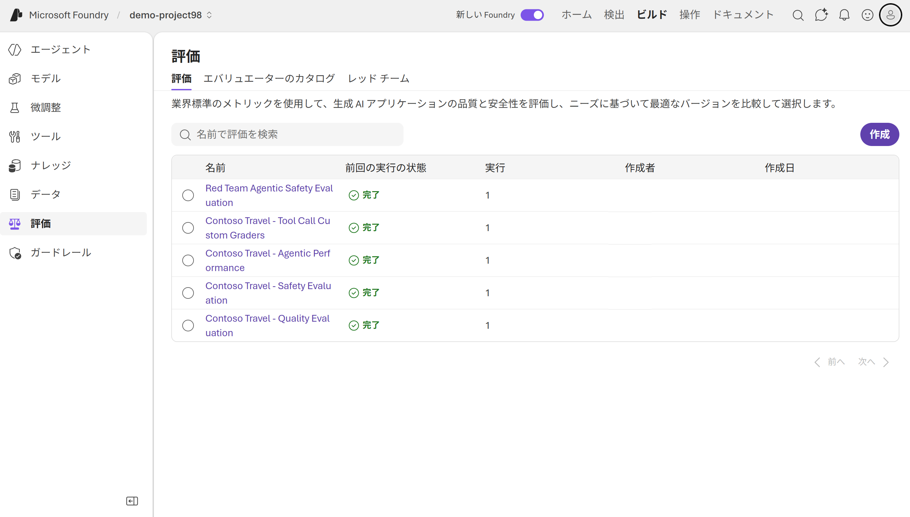

<!--
============================================================
このファイルは ../../lab-template.md を写経して作成されました。
セクション見出し (## ゴール 〜 ## 次の Lab) は削除しないこと。
記入欄を埋めて Lab の中身を書いてください。
============================================================
-->

# Lab 3: 作ったエージェントの評価

> **担当**: TBD
> **所要時間目安**: 約 45 分

---

## ゴール

この Lab を終えると、次のことができるようになります:

- [ ] Microsoft Foundry の **組み込み評価器** でエージェントの品質・安全性・エージェント性能を体系的に評価できる
- [ ] **カスタム評価器 (Custom Grader)** を作成し、エージェント固有の基準 (ツール選択の正確さなど) を定量評価できる
- [ ] **AI レッドチーミング** をクラウドで実行し、本番デプロイ前にエージェントの脆弱性を発見できる

---

## 学習内容

- Foundry **Evals API** (`openai_client.evals`) を使った評価ジョブの作成・実行・結果取得
- 組み込み評価器: 流暢性 / 一貫性 / タスク遵守、安全性 (暴力・ヘイト・自傷)、エージェント性能 (意図解決・根拠性・関連性)
- `python` グレーダーと `score_model` グレーダー (LLM-as-judge) によるカスタム評価
- AI Red Teaming Agent による敵対的テスト (攻撃戦略・評価タクソノミー・攻撃成功率)
- Foundry ポータルの **Evaluations** 画面での結果の確認方法

---

## 前提

開始前に次が完了していること:

- [ ] [Lab 2](../lab2-hosted-agent-deploy/README.md) を完了している　(この Lab は独立しているため必須ではない)
- [ ] Foundry プロジェクトが作成済み
- [ ] **VS Code** (Python / Jupyter 拡張機能) がインストール済み
- [ ] `.env` に必要な環境変数 (後述) が設定されている

---

## 手順

> 💡 この Lab では、別リポジトリの評価ワークショップ用ノートブックを 3 つ実行します。
> Exercise 1〜3 はそれぞれ 1 つのノートブックに対応します。

> ⚠️ **共通の注意**: ノートブックは各セルの出力を確認しながら進めてください。各ノートブックの末尾には **クリーンアップ用セル** がありますが、実行する必要がありません。

### 準備: リポジトリのクローンと環境構築

評価用ノートブックは別リポジトリ [foundry-observability-workshop](https://github.com/notanaha/foundry-observability-workshop.git) にあります。任意の作業フォルダーで次を実行します。

```powershell
# 1. リポジトリをクローン
git clone https://github.com/notanaha/foundry-observability-workshop.git
cd foundry-observability-workshop

# 2. Python 仮想環境を作成して有効化
python -m venv .venv
.\.venv\Scripts\Activate.ps1

# 3. 依存パッケージをインストール
pip install -r requirements.txt
```

次に、Azure に認証し、環境変数ファイルを用意します。

```powershell
# 4. Azure にログイン (テナントが複数ある場合は --tenant <TENANT_ID> を付ける)
az login --tenant <tenant-id>

# 5. sample.env を .env としてコピー 
cd /labs/notebooks
copy sample.env .env
```

`.env` をエディターで開き、最低限 次の 2 つを Foundry ポータルの値で埋めます (取得場所は `sample.env` のコメント参照)。

| 変数名 | 取得場所 |
|--------|---------|
| `TENANT_ID` | Azure ポータル → Microsoft Entra ID |
| `AZURE_AI_PROJECT_ENDPOINT` | Foundry ポータル → プロジェクト → 概要 → Project endpoint |
| `AZURE_AI_MODEL_DEPLOYMENT_NAME` | Foundry ポータル → Models + endpoints → 名前列 |
| `MODEL_ENDPOINT` | AI Services endpoint (`AZURE_AI_PROJECT_ENDPOINT`) の /api/projects/... を削除 https://<account>.services.ai.azure.com の形式|


最後に VS Code でリポジトリを開き、ノートブックを開いたら右上の **カーネルを選択** から作成した `.venv` (Python 3.1x) を選びます。


### Exercise 1: 組み込み評価器でエージェントを評価する

[`labs/notebooks/prompt-agents/lab-05-evaluation.ipynb`](https://github.com/notanaha/foundry-observability-workshop/blob/main/labs/notebooks/prompt-agents/lab-05-evaluation.ipynb) を開き、セルを上から順に実行します。

このノートブックでは「テストデータ → エージェント → レスポンス → 評価器 → スコア」の評価パイプラインを 3 部構成で体験します。

- **パート A — 品質評価**: 流暢性 / 一貫性 / タスク遵守 の 3 評価器でレスポンス品質をスコアリング
- **パート B — 安全性評価**: 暴力 / ヘイト・不公平 / 自傷 の組み込みコンテンツ安全評価器を実行
- **パート C — エージェント性能評価**: 意図解決 / 根拠性 / 関連性 で「エージェントらしさ」を測定

### Exercise 2: カスタム評価器 (Custom Grader) を作る

[`labs/notebooks/prompt-agents/lab-06-evaluation-custom.ipynb`](https://github.com/notanaha/foundry-observability-workshop/blob/main/labs/notebooks/prompt-agents/lab-06-evaluation-custom.ipynb) を開き、セルを上から順に実行します。

このノートブックは 2 フェーズ構成です。

- **Phase 1**: `search_flights` / `search_hotels` / `search_car_rentals` の Function Tools 付きエージェントを実行し、実際の `function_call` (ツール名・パラメーター) を収集して JSONL データセットとして Foundry にアップロード
- **Phase 2**: 収集データを 3 種類のカスタム評価器で採点
  - `correct_tool_called` (`python`) — 期待どおりのツールを選んだか (0.0 / 1.0)
  - `required_params_present` (`python`) — 必要なパラメーターが揃っているか (部分点あり)
  - `routing_quality` (`score_model`) — LLM-as-judge によるルーティング判断の総合評価 (1〜5)

`python` グレーダーは Foundry のサンドボックスで `grade(sample, item)` 関数として実行されます。組み込み評価器だけでは測れない、業務固有の正しさを評価できることを確認してください。

### Exercise 3: エージェントをレッドチームする (OPTIONAL)

[`labs/notebooks/prompt-agents/lab-07-redteam.ipynb`](https://github.com/notanaha/foundry-observability-workshop/blob/main/labs/notebooks/prompt-agents/lab-07-redteam.ipynb) を開き、セルを上から順に実行します。

このノートブックでは AI Red Teaming Agent を使い、**クラウドで** 自動敵対的テストを実行します。

- エージェント固有の安全性評価器 (`builtin.prohibited_actions` / `builtin.task_adherence` / `builtin.sensitive_data_leakage`) でレッドチーム評価を作成
- 攻撃戦略 `Flip` / `Base64` / `IndirectJailbreak` と評価タクソノミー (リスクカテゴリ) を設定
- マルチターン (5 ターン) のレッドチーム実行を作成し、サーバー側処理を 15 秒間隔でポーリング
- 結果カウント (攻撃成功率) を確認し、出力アイテムを JSON ファイルに保存

> ⏳ レッドチームスキャンは攻撃戦略数とターン数によっては **数分かかります**。`in_progress` が続いても異常ではありません。

実行後は、ノートブック末尾の「結果の解釈」「緩和戦略」のセクションも読み、トラベルエージェントに多い脆弱性パターンを把握してください。

---

## 成功確認

次がすべて満たされていれば成功です:

- [ ] 3 つのノートブックすべてで評価/レッドチーム実行が `completed` になる
- [ ] 各ノートブックの出力にクエリ (または攻撃アイテム) ごとのスコアが表示される
- [ ] Foundry ポータルの **Evaluations** 画面に、品質・安全性・エージェント・カスタム・レッドチームの実行一覧とスコアが表示される

スクリーンショット例:



---

## よくあるエラー

| 症状 | 想定原因 | 解決方法 |
|---|---|---|
| `KeyError: 'AZURE_AI_PROJECT_ENDPOINT'` | `.env` が未作成、または `labs/notebooks/` 以外の場所にある | `sample.env` を `labs/notebooks/.env` にコピーし、値を設定する |
| `ModuleNotFoundError: azure.ai.projects` 等 | 仮想環境が未有効化、または VS Code のカーネルが `.venv` 以外 | `pip install -r requirements.txt` を実行し、カーネルに `.venv` を選択する |
| `CredentialUnavailableError` / 認証エラー | `az login` 未実行、またはテナント不一致 | `az login` (必要なら `--tenant <TENANT_ID>`) を実行。`.env` に `TENANT_ID` を設定 |
| 評価 run が `failed` になる | モデルデプロイ名の不一致、TPM クォータ不足 | `.env` の `AZURE_AI_MODEL_DEPLOYMENT_NAME` とポータルのデプロイ名を一致させ、クォータを確認 |
| レッドチーム run が長時間 `in_progress` | 仕様 (クラウドでマルチターン攻撃を生成・実行中) | 完了まで待つ。数分かかる場合がある |

> 上記で解決しない場合は [../../troubleshooting.md](../../troubleshooting.md) も参照してください。

---

## Challenge (任意)

時間が余った参加者向けの追加課題です:

OPTIONAL の Exercise 3: エージェントをレッドチームする を実行してください

[`labs/notebooks/prompt-agents/lab-07-redteam.ipynb`](https://github.com/notanaha/foundry-observability-workshop/blob/main/labs/notebooks/prompt-agents/lab-07-redteam.ipynb) 

---

## 次の Lab

→ ワークショップ完了 🎉 お疲れさまでした!
お時間があれば [README.md](../../README.md) のチェックリストで完了確認をしてください。
